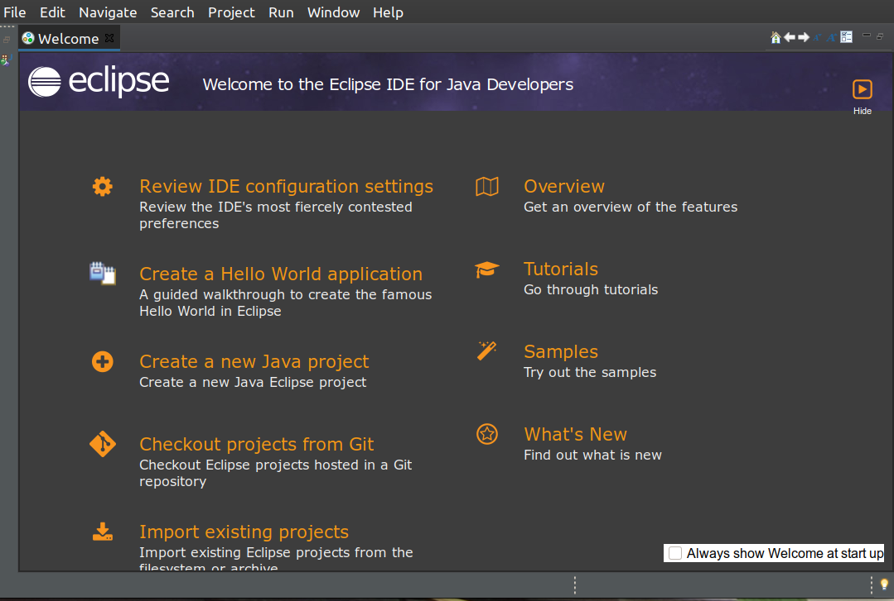
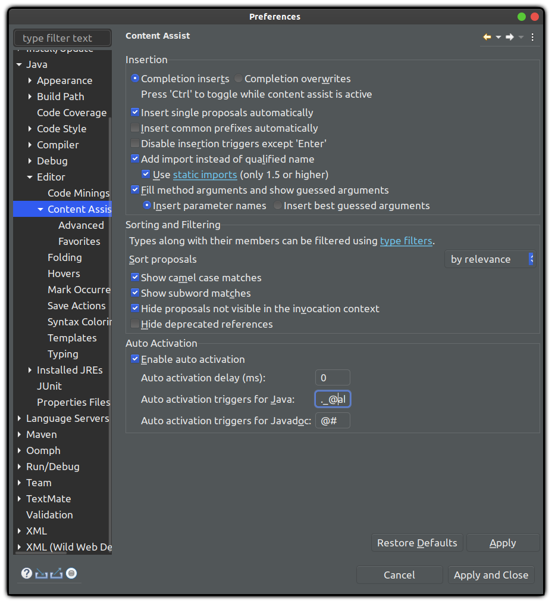
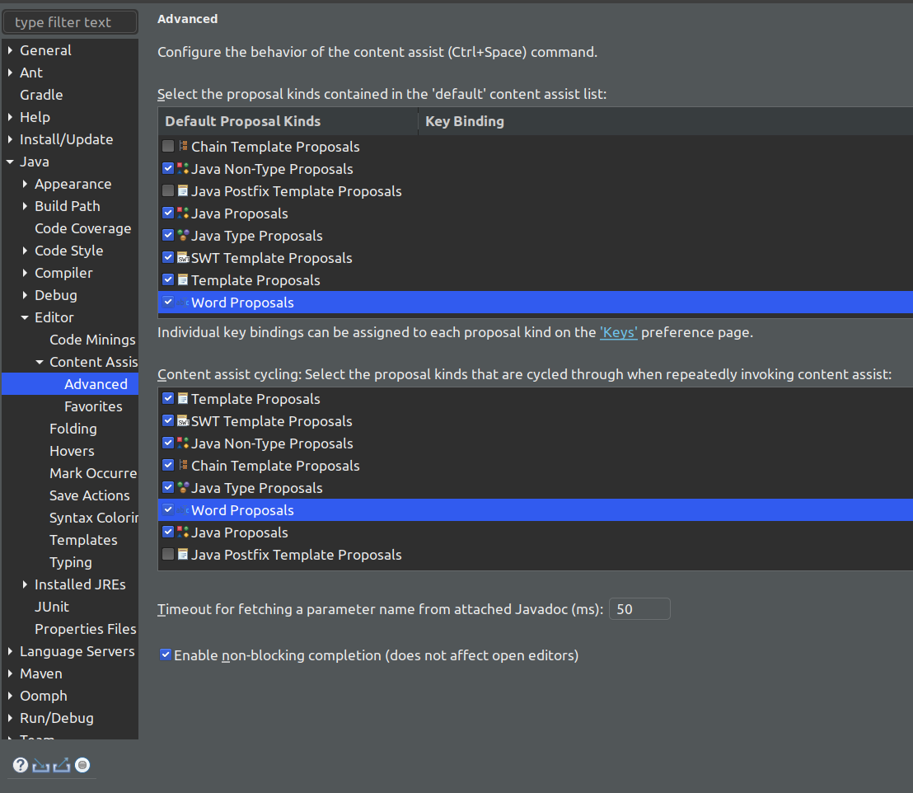

# Install Eclipse by installer package on Ubuntu 20.04

06 Nov 2020




**Eclipse** is widely used for Java Developers. You can install other IDE for Eclipse too. I don't want to use `snap install eclipse` but want to install from its installer.

# Requirements

- Require Java

```bash
sudo apt install openjdk-11-jdk-headless
```

##  To install it, I followed this instruction:

https://askubuntu.com/questions/695382/how-to-install-eclipse-using-its-installer

- I run with `sudo ./eclipse-inst` and use and use `/opt` as installation path. 
- Do not use `/root/java-2020-09` this will cause many troubles later.

## We need to create a desktop file.

 `sudo nano /usr/share/applications/eclipse.desktop`

Remember to update the desktop file accordingly to your version. Here is mine:


```bash
            
[Desktop Entry]
Encoding=UTF-8
Name=Eclipse Java IDE
Type=Application
Exec=/opt/java-2020-09/eclipse/eclipse
Terminal=false
Icon=/opt/java-2020-09/eclipse/icon.xpm
Comment=Integrated Development Environment
NoDisplay=false
Categories=Development;IDE;
Name[en]=Eclipse
Name[en_US]=Eclipse
```


When you launch Eclipse from the Applications center by clicking on its icon, if you get error

`The Eclipse executable launcher was unable to locate its companion shared library`

You can easily fix it with this one:

Remember to replace `youruser` to your real user. See the explanations here https://askubuntu.com/a/1272660 

```bash
setfacl -R -m u:youruser:rx /root
```

To check ACL permissions were set properly:

```bash
# getfacl /root
```


## Enable autocomplete

- Follow this instructions https://stackoverflow.com/a/58869184

Go to Windows--> Preference--->Java--->Content  Assist--->Enable auto activation (checked)

And in Auto  activation triggers for java: Insert these chars:

```
._@abcdefghijklmnopqrstuvwxyzABCDEFGHIJKLMNOPQRSTUVWXYZ

```




- And also https://stackoverflow.com/a/60235868

Enable (Both places)

```
Java Non-Type Proposals
Java Proposals
Java Type Proposals
```

  

